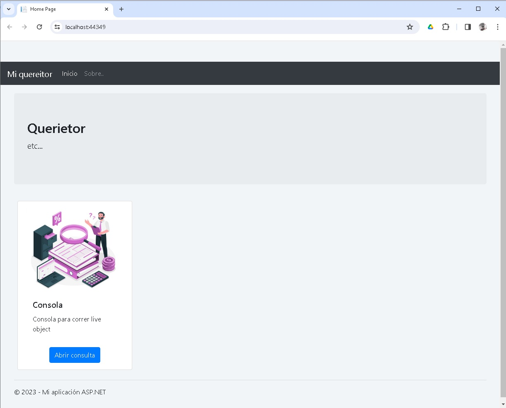
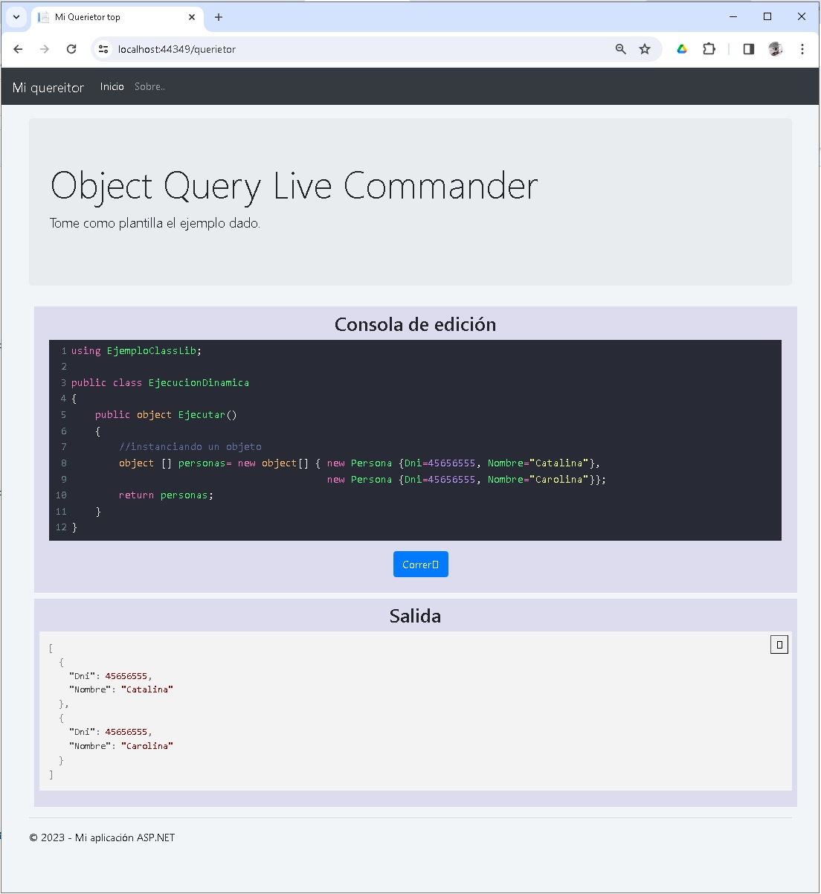

# querietor

### Descripción
La idea principal es poder correr c# en vivo desde una consola web de una forma similar a como se puede correr sentencias sql. 

Aún hay problemas a resolver:
- con el coloreado del código, cuando se ejecuta el código el coloreado desparece
- hay que agregar un control para que se pueda cargar las ddls con las clases que se quiera usar.

     

###  Vista Web

Implementación web

  

        
        
Figura 1. Vista del menú principal

  

  

     
     
Figura 2. Consola 

  

